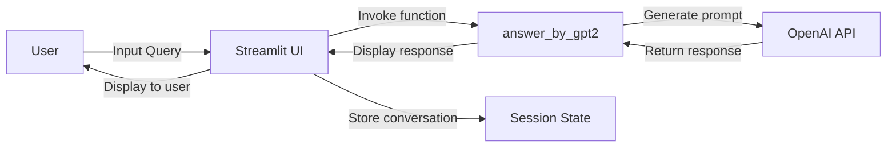

## 1. 소개 및 기획 배경
### 프로젝트 목표
이 프로젝트는 한국 화장품을 구매하려는 외국인 고객을 대상으로, 한국 인플루언서 추천 정보를 기반으로 개인화된 화장품을 추천하는 챗봇 시스템을 구축하는 것입니다. 사용자의 요구에 맞는 제품을 추천해 고객이 더 쉽고 빠르게 제품을 선택할 수 있도록 돕습니다.

### 기획 배경
이 시스템은 실제 경험을 바탕으로 기획되었습니다. 한국에 온 교환학생들에게 화장품을 추천할 때, 한국 현지인의 추천 정보가 대부분 한국어로 제공되어 접근이 어려운 문제를 경험했습니다. 또한, 외국인 고객들이 한국 화장품을 선호하는 경향이 있어, 언어 장벽을 해결할 필요성을 느꼈습니다.

따라서, 한국인 인플루언서의 추천 정보를 영어로 변환하여, 외국인 고객에게 적합한 화장품을 추천하는 시스템을 기획하였습니다. 이를 통해 외국인 관광객들이 한국 화장품을 더 쉽게 선택하고, 구매 결정을 돕는 역할을 할 것으로 기대됩니다.

## 2. System Architecture Diagram



## 3. 설치 및 실행 방법

<details>
  <summary>필수 요구 사항</summary>
  
  - Python 3.11
  - Poetry (패키지 관리 도구)
</details>

<details>
  <summary>Python 설치</summary>
  
  Python이 설치되어 있지 않다면, 아래 방법으로 Python 3.11을 설치해주세요:
  
  - **Windows**: pyenv 설치 가이드를 참고하여 pyenv를 통해 Python 3.11 설치
  - **Mac**: Homebrew를 통해 pyenv로 Python 3.11 설치
</details>

<details>
  <summary>Poetry 설치</summary>
  
  Poetry가 설치되어 있지 않다면, 아래 명령어로 Poetry를 설치하세요:
  
  **Windows:**
  ```
  pip install poetry
  ```
  **Mac:**
  ```
  pip3 install poetry
  ```
</details>

<details>
    <summary>프로젝트 파일 준비</summary>
프로젝트 디렉토리에서 pyproject.toml과 poetry.lock 파일을 확인하세요. 이 파일들이 있어야 필요한 패키지가 자동으로 설치됩니다.
</details>

<details>
    <summary>가상환경 설정 및 패키지 설치</summary>
프로젝트 디렉토리로 이동 후, 아래 명령어를 실행하여 가상환경을 생성하고 필요한 라이브러리를 설치하세요:
    
  ```
  poetry install
  ```
</details>

<details>
    <summary>가상환경 활성화</summary>
가상환경을 활성화하려면, 아래 명령어를 실행하세요:
    
  ```
  poetry shell
  ```
</details> 

<details>
    <summary>프로그램 실행</summary>
가상환경이 활성화된 후, 아래 명령어로 챗봇 프로그램을 실행할 수 있습니다:
    
  ```
  streamlit run main.py
  ```
</details> 

## 4. 환경 변수 설정

이 프로젝트는 외부 API와 통신하기 위해 두 가지 환경 변수가 필요합니다:

1. **OPEN_API_KEY**  
   - OpenAI API 키입니다.
   - `.env` 파일에 추가:
     ```env
     OPEN_API_KEY=your_openai_api_key_here
     ```

2. **LANGCHAIN_API_KEY**  
   - LangChain API 키입니다.
   - `.env` 파일에 추가:
     ```env
     LANGCHAIN_API_KEY=your_langchain_api_key_here
     ```

### `.env` 파일 예시:
```env
OPEN_API_KEY=your_openai_api_key_here
LANGCHAIN_API_KEY=your_langchain_api_key_here
```

## 5. 주요 의존성 및 기술 스택

이 프로젝트는 여러 가지 라이브러리와 기술 스택을 사용하여 챗봇 시스템을 구축합니다. 아래는 주요 의존성 목록입니다:

### 주요 의존성

1. **OpenAI (openai)**  
   - OpenAI의 GPT 모델을 사용하여 자연어 처리 기능을 구현합니다.

2. **LangChain**  
   - LangChain은 여러 외부 API를 통합하여 대화형 응용 프로그램을 구축하는 데 사용되는 라이브러리입니다.

3. **Streamlit**  
   - 웹 애플리케이션을 쉽게 만들 수 있도록 지원하는 라이브러리로, 사용자 인터페이스를 구축하는 데 사용됩니다.

4. **Poetry**  
   - Python 프로젝트의 의존성 관리를 위한 패키지 관리자입니다. 이 프로젝트에서는 `pyproject.toml` 파일을 통해 의존성 및 가상 환경을 관리합니다.

### 기술 스택

- **Python (= 3.11)**  
  - 이 프로젝트는 Python 3.11 에서 실행됩니다.

- **LangChain**  
  - LangChain을 사용하여 다양한 언어 모델과 외부 API를 연결하고 대화형 응용 프로그램을 구축합니다.

- **Streamlit**  
  - 실시간으로 동작하는 웹 애플리케이션을 만들기 위해 사용됩니다. 사용자가 챗봇과 상호작용할 수 있는 UI를 제공합니다.

- **OpenAI API**  
  - GPT 모델을 기반으로 한 대화형 챗봇을 구현하는 데 사용됩니다.

이 외에도 프로젝트에 필요한 다양한 라이브러리들이 `pyproject.toml`에 명시되어 있으며, `poetry install` 명령어로 자동으로 설치됩니다.

## 6. 시연 영상 및 배포 링크

프로젝트의 시연 영상을 확인하고, 실제 서비스 환경을 통해 동작을 확인하실 수 있습니다.

### 시연 영상
- 아래 영상을 통해 챗봇 프로그램의 동작을 확인하실 수 있습니다.
  .mp4")

### 배포 링크
-  [여기를를](https://miniproject-k-cos.streamlit.app/)을 통해 실시간 챗봇 서비스를 사용하실 수 있습니다. 
  
